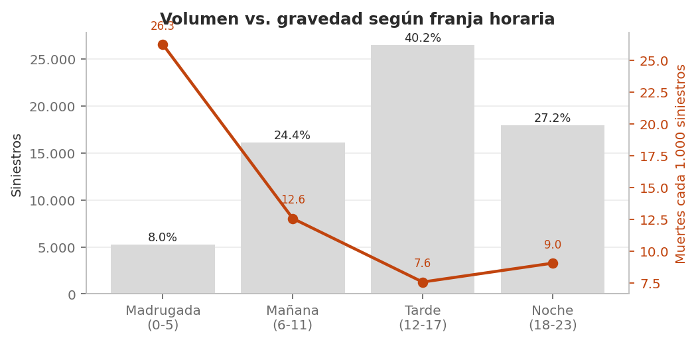

# 🚦 Análisis estadístico de siniestros viales · Ciudad de Buenos Aires 2019–2025

> **Proyecto de portafolio · Data Analyst** · Estadística descriptiva aplicada a política pública · Excel + Data Storytelling



## 🎯 Problema de negocio
La Agencia Nacional de Seguridad Vial (ANSV) necesita focalizar campañas de prevención con recursos limitados. Existen datos abiertos sobre siniestros, pero sin análisis sistemático no generan decisiones. Este proyecto procesa **65.818 siniestros viales con víctimas** ocurridos en la Ciudad de Buenos Aires entre 2019 y 2025 y responde tres preguntas concretas.

| Pregunta | Respuesta con evidencia |
|---|---|
| **¿Cuándo ocurren más?** | La tarde (12–17 hs) concentra el **40,2 %** de los siniestros; el viernes es el día pico (16,9 %) y el momento de mayor volumen es el **viernes por la tarde** (7,1 % del total). |
| **¿Cuándo son más graves?** | La madrugada (0–5 hs) tiene solo el 8,0 % de los hechos pero **26,3 muertes cada 1.000 siniestros**: 3,5 veces la letalidad de la tarde. |
| **¿Qué usuarios y vías?** | Moto, peatón y bicicleta: **62,4 % de los siniestros y 87,5 % de las muertes**. Avenidas: 60,6 % de las muertes; autopistas: la mayor letalidad (68,2 cada 1.000). |
| **¿Mejora o empeora?** | **Empeora en frecuencia y mejora en gravedad**: +15,7 % de siniestros (2019→2025) y −12,5 % de víctimas mortales; la letalidad bajó de 10,2 a 7,7 cada 1.000. |

## 📊 Cifras del análisis
| Indicador | Valor |
|---|---|
| Siniestros analizados | **65.818** (2019–2025) |
| Víctimas / víctimas mortales | **75.193** / **703** |
| Víctimas por siniestro | media 1,14 · mediana 1 · moda 1 · σ 0,51 · CV 44,9 % · máx. 26 |
| Distribución | 89,7 % de los siniestros tiene una sola víctima (asimetría positiva) |
| Calidad de datos | 0 duplicados · 0 filas eliminadas · 3.276 totales recalculados · 11.217 comunas unificadas |

## 📁 Entregables
- 📈 **[Libro de análisis en Excel](02_analisis/analisis_siniestros_viales_caba.xlsx)** — 15 hojas: diccionario, log de limpieza, clasificación de variables, base agregada, 5 tablas de frecuencias, estadísticas descriptivas, tabla cruzada día × franja, análisis temporal, hallazgos y gráficos. Todas las fórmulas quedan activas.
- 📄 **[Informe estadístico (5 páginas, PDF)](03_informe/informe_siniestros_viales_caba.pdf)** — resumen ejecutivo, metodología, resultados, conclusiones, recomendaciones y limitaciones.
- 📊 **[Presentación ejecutiva (8 slides)](04_presentacion/presentacion_ansv_siniestros_viales.pptx)** — versión para la dirección de la ANSV.
- 🗂️ **[Base agregada (CSV)](01_datos/processed/base_agregada_siniestros.csv)** — todos los conteos que alimentan el análisis.

## 🛠️ Qué demuestra este proyecto
- **Clasificación estadística de variables**: cuantitativa/cualitativa, discreta/continua y escalas nominal, ordinal, de intervalo y de razón, con justificación para cada variable.
- **Tablas de frecuencias completas**: absoluta, relativa, porcentual y acumulada para franja horaria, modo de desplazamiento, tipo de vía, gravedad y número de víctimas.
- **Medidas descriptivas**: media, mediana, moda, rango, varianza, desvío estándar, coeficiente de variación, cuartiles, RIC y análisis de asimetría, cada una con su interpretación escrita.
- **Elección correcta del gráfico según el tipo de variable**: barras para cualitativas, histograma para la cuantitativa discreta, líneas con tendencia para la serie temporal, torta para gravedad y boxplot para comparar dispersión.
- **Limpieza documentada**: cada problema detectado (valores “SD”, dos formatos de comuna, fechas irregulares, errores `#¡REF!`) con su decisión y el número de registros afectados.
- **Comunicación a audiencia no técnica**: informe y presentación orientados a decisiones, no a métodos.

## 🗂️ Estructura
```text
├── 01_datos/
│   ├── raw/        # instrucciones de descarga del dataset original (12 MB, no versionado)
│   └── processed/  # base agregada en CSV
├── 02_analisis/    # libro de Excel con todo el análisis
├── 03_informe/     # informe de 5 páginas (PDF + DOCX)
├── 04_presentacion/# presentación ejecutiva de 8 slides
├── img/            # gráficos del proyecto
└── README.md
```

## 🔎 Fuente de datos
**Buenos Aires Data — “Siniestros viales” (hechos)**, Secretaría de Transporte y Obras Públicas, Gobierno de la Ciudad de Buenos Aires.
Ficha: https://data.buenosaires.gob.ar/dataset/victimas-siniestros-viales · Período: 01/01/2019 – 31/12/2025.

## ⚠️ Limitaciones
- Solo incluye siniestros **con víctimas** informados a la autoridad: las cifras son un piso, no el universo de hechos de tránsito.
- Análisis **descriptivo**: identifica patrones, no causas.
- No incorpora exposición (cantidad de motos, autos o peatones circulando), por lo que la letalidad mide gravedad del hecho y no riesgo individual.
- Las categorías “No informado” (16,6 % en modo, 19,1 % en vía) se concentran en los años recientes.

## 👤 Autor
**Jeisson Marin Uribe Luis** — Data Analyst · Estudiante de Ingeniería de Sistemas e Ingeniería Industrial · Scrum Master · Six Sigma Yellow Belt · Power BI & Excel
🐙 [github.com/ujeisson-alt](https://github.com/ujeisson-alt)
